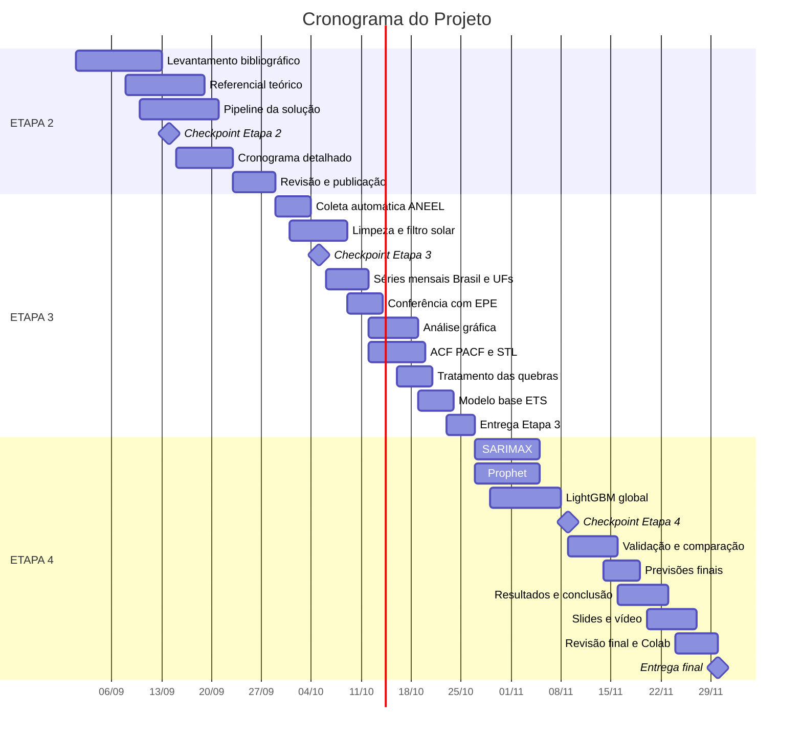

# Projeto Aplicado IV - Mackenzie (Cronograma Detalhado)

## Visão Geral

Este cronograma detalha as atividades previstas para o projeto de análise e previsão do crescimento da energia solar distribuída no Brasil. A Etapa 1 foi concluída em 31/08, e as etapas seguintes estão divididas em atividades com datas e responsáveis definidos, indo além do calendário da disciplina.

## ETAPA 2 – Referencial Teórico e Cronograma (28 dias)

**Segunda entrega: 28 de setembro**

| **Período** | **Atividades** | **Responsável** |
| --- | --- | --- |
| 01/09 - 12/09 | Levantamento bibliográfico de trabalhos correlatos | Todos |
| 08/09 - 18/09 | Escrita do referencial teórico | Vinícius Sabiá |
| 10/09 - 20/09 | Desenho e discussão do pipeline da solução | Enzo Ferroni |
| 14/09 | Checkpoint da Etapa 2 com o professor | Todos |
| 15/09 - 22/09 | Elaboração do cronograma detalhado | Daniel dos Santos |
| 23/09 - 28/09 | Revisão do notebook e publicação no GitHub | Enzo Ferroni |

## ETAPA 3 – Implementação Parcial (28 dias)

**Terceira entrega: 26 de outubro**

| **Período** | **Atividades** | **Responsável** |
| --- | --- | --- |
| 29/09 - 03/10 | Script de coleta automática da base da ANEEL | Enzo Ferroni |
| 01/10 - 08/10 | Limpeza e filtro da fonte solar fotovoltaica | Daniel dos Santos |
| 05/10 | Checkpoint da Etapa 3 com o professor | Todos |
| 06/10 - 11/10 | Construção das séries mensais do Brasil e das UFs | Daniel dos Santos |
| 09/10 - 13/10 | Conferência dos agregados com o painel da EPE | Vinícius Sabiá |
| 12/10 - 18/10 | Análise gráfica da série nacional e por UF | Vinícius Sabiá |
| 12/10 - 19/10 | ACF, PACF, testes de estacionariedade e decomposição STL | Enzo Ferroni |
| 16/10 - 20/10 | Tratamento das quebras (Lei 14.300 e migração do SISGD) | Daniel dos Santos |
| 19/10 - 23/10 | Modelos de referência e primeiro modelo base (ETS) | Enzo Ferroni |
| 23/10 - 26/10 | Atualização do pipeline e do cronograma e entrega da Etapa 3 | Todos |

## ETAPA 4 – Implementação e Entrega Final (35 dias)

**Quarta e última entrega: 30 de novembro**

| **Período** | **Atividades** | **Responsável** |
| --- | --- | --- |
| 27/10 - 04/11 | Modelo SARIMAX com variável da Lei 14.300 | Daniel dos Santos |
| 27/10 - 04/11 | Modelo Prophet com pontos de mudança | Vinícius Sabiá |
| 29/10 - 07/11 | Modelo LightGBM global para as UFs | Enzo Ferroni |
| 09/11 | Checkpoint da Etapa 4 com o professor | Todos |
| 09/11 - 15/11 | Validação com origem móvel e comparação dos modelos | Todos |
| 14/11 - 18/11 | Previsões finais do Brasil e das UFs com intervalos | Enzo Ferroni |
| 16/11 - 22/11 | Resultados, discussão e conclusão no notebook | Daniel dos Santos e Vinícius Sabiá |
| 20/11 - 26/11 | Slides e gravação do vídeo de apresentação | Todos |
| 24/11 - 29/11 | Revisão final, README e teste de execução do zero no Colab | Enzo Ferroni |
| 30/11 | Entrega final do projeto | Todos |

## Linha do Tempo

## Divisão de Responsabilidades

| **Membro da Equipe** | **Responsabilidades** |
| --- | --- |
| Daniel dos Santos | Elaboração do cronograma detalhado Limpeza e filtro da fonte solar fotovoltaica Construção das séries mensais do Brasil e das UFs Tratamento das quebras (Lei 14.300 e migração do SISGD) Modelo SARIMAX com variável da Lei 14.300 Resultados, discussão e conclusão no notebook |
| Enzo Ferroni | Desenho e discussão do pipeline da solução Revisão do notebook e publicação no GitHub Script de coleta automática da base da ANEEL ACF, PACF, testes de estacionariedade e decomposição STL Modelos de referência e primeiro modelo base (ETS) Modelo LightGBM global para as UFs Previsões finais do Brasil e das UFs com intervalos Revisão final, README e teste de execução do zero no Colab |
| Vinícius Sabiá | Escrita do referencial teórico Conferência dos agregados com o painel da EPE Análise gráfica da série nacional e por UF Modelo Prophet com pontos de mudança Resultados, discussão e conclusão no notebook |

As atividades marcadas como Todos (levantamento bibliográfico, checkpoints, validação dos modelos, vídeo e entregas) são feitas em conjunto pelo grupo.

## Marcos Importantes

| **Marco** | **Data Prevista** |
| --- | --- |
| Entrega da Etapa 1 (Definição do projeto e equipe) | 31/08/2026 (concluída) |
| Checkpoint da Etapa 2 | 14/09/2026 |
| Entrega da Etapa 2 (Referencial Teórico e Cronograma) | 28/09/2026 |
| Checkpoint da Etapa 3 | 05/10/2026 |
| Entrega da Etapa 3 (Implementação Parcial) | 26/10/2026 |
| Checkpoint da Etapa 4 | 09/11/2026 |
| Entrega Final e Vídeo de Apresentação | 30/11/2026 |

---
