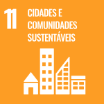

# Análise e Previsão do Crescimento da Energia Solar Distribuída no Brasil

**Projeto Aplicado IV — Ciência de Dados EaD — 2026/02**
Universidade Presbiteriana Mackenzie — Faculdade de Computação e Informática

---

## Equipe

| Integrante | Matrícula |
|---|---|
| Daniel dos Santos da Silva | 10720767 |
| Enzo Ferroni | 10417100 |
| Vinícius de Souza Sabiá | 10721475 |

## Problema

A expansão da micro e minigeração distribuída (MMGD) solar no Brasil é acompanhada
de forma predominantemente descritiva e retrospectiva. As projeções setoriais
existentes são construídas em escala nacional e por cenários regulatórios, e não
fornecem previsões por unidade federativa ou por município.

> **Como modelar a evolução histórica da potência instalada e do número de
> empreendimentos de geração solar distribuída no Brasil, de modo a produzir
> previsões de curto e médio prazo em nível nacional e estadual, e a caracterizar
> as diferenças regionais desse crescimento?**

## Objetivo

Desenvolver um produto analítico de séries temporais capaz de caracterizar e prever
o crescimento da geração solar fotovoltaica distribuída no Brasil, a partir dos dados
públicos de MMGD da ANEEL, com previsões em nível nacional e estadual.

**Variável-alvo:** potência instalada acumulada (kW) e número de novas conexões
solares fotovoltaicas, agregados em periodicidade mensal a partir da data de conexão.

## ODS relacionados

<p align="left">
  
  
  
</p>

O projeto se relaciona aos três ODS definidos para o semestre:

- **ODS 8 — Trabalho decente e crescimento econômico:** cadeia produtiva e investimentos mobilizados pelo setor solar.
- **ODS 11 — Cidades e comunidades sustentáveis:** descentralização da geração e redução da pressão sobre a infraestrutura de transmissão.
- **ODS 16 — Paz, justiça e instituições eficazes:** especificamente pelas metas **16.6** (instituições eficazes, responsáveis e transparentes) e **16.10** (acesso público à informação). O projeto se apoia integralmente em dados abertos publicados pelo regulador e converte esse acervo em evidência sobre os efeitos da Lei nº 14.300/2022, ampliando a capacidade de escrutínio público sobre uma política setorial.

## Base de dados

**Fonte principal:** [ANEEL — Relação de empreendimentos de Mini e Micro Geração Distribuída](https://dadosabertos.aneel.gov.br/dataset/relacao-de-empreendimentos-de-geracao-distribuida) (Portal de Dados Abertos)

| Item | Descrição |
|---|---|
| Natureza | Registro administrativo censitário enviado pelas distribuidoras ao regulador |
| Formatos | CSV compactado em ZIP e Apache Parquet, com dicionário de dados em PDF |
| Granularidade | Um registro por empreendimento conectado à rede |
| Cobertura | Nacional, com identificação por UF e município |
| Período | Registros a partir de dezembro de 2008 |
| Atualização | Diária, conforme metadados do portal |

**Fonte complementar:** [EPE — Painel de Dados de MMGD (PDGD)](https://dashboard.epe.gov.br/apps/pdgd/), usada para validação cruzada dos agregados.

**Limitações já identificadas:** quebras estruturais associadas à Lei nº 14.300/2022;
interrupção da atualização da base entre 23/09/2025 e 13/11/2025 pela migração do
sistema SISGD para o novo sistema de MMGD; defasagem entre data de conexão e data de
registro nos meses mais recentes.

## Solução proposta

Notebook Python executável e reprodutível, contemplando coleta, pré-processamento,
análise exploratória, modelagem e avaliação. Modelos candidatos: suavização
exponencial e ARIMA/SARIMA como referência estatística clássica, Prophet pela
robustez a mudanças de tendência, e modelos baseados em árvores como alternativa.
Avaliação por validação em janelas temporais, com métricas MAE, RMSE e MAPE.

## Estrutura do repositório

```
├── README.md
├── .gitignore
├── notebooks/
│   └── projeto_aplicado_IV_doc.ipynb # documento inicial do projeto (Etapa 1)
├── data/
│   └── README.md                     # origem dos dados (dados brutos não versionados)
└── figuras/
```

Os dados brutos não são versionados neste repositório, em razão do volume e da
atualização diária na fonte. Ver [`data/README.md`](data/README.md).

## Cronograma de entregas

| Etapa | Prazo | Conteúdo | Situação |
|---|---|---|---|
| 1 | 31/08/2026 | Definição do projeto, equipe, base de dados e documento inicial | Concluída |
| 2 | 28/09/2026 | Referencial teórico, pipeline da solução e cronograma | — |
| 3 | 26/10/2026 | Análise exploratória, pré-processamento e modelo base | — |
| 4 | 30/11/2026 | Comparação de modelos, resultados e entrega final | — |

## Referências

AGÊNCIA NACIONAL DE ENERGIA ELÉTRICA. **Micro e minigeração distribuída.** Brasília: ANEEL, 2026a. Disponível em: https://www.gov.br/aneel/pt-br/assuntos/geracao-distribuida. Acesso em: 1 set. 2026.

AGÊNCIA NACIONAL DE ENERGIA ELÉTRICA. **Relação de empreendimentos de mini e micro geração distribuída.** Brasília: Portal de Dados Abertos da ANEEL, 2026b. Disponível em: https://dadosabertos.aneel.gov.br/dataset/relacao-de-empreendimentos-de-geracao-distribuida. Acesso em: 1 set. 2026.

BRASIL. **Lei nº 14.300, de 6 de janeiro de 2022.** Institui o marco legal da microgeração e minigeração distribuída, o Sistema de Compensação de Energia Elétrica (SCEE) e o Programa de Energia Renovável Social (PERS). Brasília, DF: Presidência da República, 2022. Disponível em: https://www.planalto.gov.br/ccivil_03/_ato2019-2022/2022/lei/l14300.htm. Acesso em: 1 set. 2026.

EMPRESA DE PESQUISA ENERGÉTICA. **Micro e minigeração distribuída & baterias atrás do medidor:** Plano Decenal de Expansão de Energia 2035. Rio de Janeiro: EPE, 2025.

EMPRESA DE PESQUISA ENERGÉTICA. **Painel de dados de micro e minigeração distribuída (PDGD).** Rio de Janeiro: EPE, 2026. Disponível em: https://dashboard.epe.gov.br/apps/pdgd/. Acesso em: 1 set. 2026.

HYNDMAN, R. J.; ATHANASOPOULOS, G. **Forecasting: principles and practice.** 3. ed. Melbourne: OTexts, 2021. Disponível em: https://otexts.com/fpp3/. Acesso em: 1 set. 2026.

ORGANIZAÇÃO DAS NAÇÕES UNIDAS. **Objetivos de desenvolvimento sustentável.** Brasília: ONU Brasil, 2026. Disponível em: https://brasil.un.org/pt-br/sdgs. Acesso em: 1 set. 2026.

TAYLOR, S. J.; LETHAM, B. Forecasting at scale. **The American Statistician,** v. 72, n. 1, p. 37-45, 2018. DOI: 10.1080/00031305.2017.1380080.
